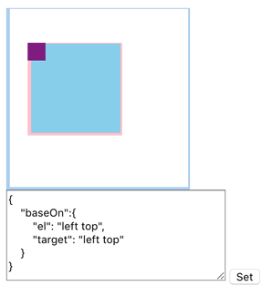

# dom-position

> dom positioin

[](https://travis-ci.org/onface/dom-position)
[](https://npmjs.org/package/dom-position)
[](https://npmjs.org/package/dom-position)

[](https://saucelabs.com/u/dom-position)

## Install

```shell
npm install dom-position --save
```

## Example

[](http://onface.github.io/dom-position/example)

## Online documentation

[Online](http://onface.github.io/dom-position)

## Change log

[CHANGELOG](./CHANGELOG.md)


## Maintainers

<table>
  <tbody>
    <tr>
      <td align="center">
        <a href="https://github.com/nimojs"></a>
        <br>
        <a href="https://github.com/nimojs">NimoChu</a>
      </td>
    <tr>
  <tbody>
</table>
